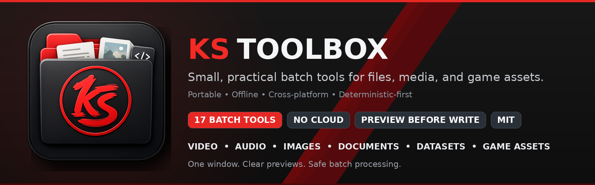

<p align="center">
  
</p>

<p align="center"><b>21 free tools in one window.</b><br>
Batch-process videos, images, audio, documents and game assets on your own computer.<br>
No account. No cloud. No credits.</p>

<p align="center">
  <a href="https://github.com/jony100200/KS-ToolBox/releases"><b>⬇ Download for Windows</b></a>
  &nbsp;·&nbsp; <a href="#tools">See all tools</a>
  &nbsp;·&nbsp; <a href="#run-it">Run from source</a>
</p>

---

## Why KS ToolBox

- **Everything in one place.** Compress video, resize and clean up images, remove backgrounds, convert files, build Unity packages and more, without hunting for a separate program for each job.
- **Safe by default.** Every tool shows a **preview** of what it will do before it writes anything, and your original files are never overwritten unless you turn that on and confirm.
- **Private and offline.** Your files never leave your computer. The only time it goes online is if you choose to download the optional AI models.
- **Portable.** On Windows there is nothing to install: unzip the folder and double-click `KS ToolBox.exe`.
- **Built for big batches.** Drop in hundreds of files, watch progress in the Queue, and get a report at the end. A broken file doesn't stop the rest.

## Start here

1. Open a work area or press **Ctrl/Cmd+K** to search for a tool.
2. Add files or a folder, set the output location, and inspect the preview.
3. Turn off **Preview only** only when the planned outputs look right.
4. Watch progress in the tool or **Queue**; each real run leaves a manifest and
   completion report beside its output where applicable.

The source files are never overwritten by default. A destructive option is
always explicit and confirmed.

## Tools

### 🎬 Video & Audio
| Tool | What it does |
|---|---|
| [**Video Compressor**](tools/video_compressor/README.md) | Shrink videos without visible quality loss — decides if a file is even worth re-encoding, then proves the result with a VMAF quality gate before touching the original. |
| [**Video Chopper**](tools/video_chopper/README.md) | Split a video into clips at black-frame gaps (scene/take boundaries). Lossless stream-copy or frame-accurate re-encode. |
| [**Audio Tool**](tools/audio_tool/README.md) | Batch convert / trim / fade / loudness-normalize audio via the bundled FFmpeg. |
| [**Format Converter**](tools/format_converter/README.md) | Convert images, audio/video, and documents through verified local adapters. |

### 🖼️ Images
| Tool | What it does |
|---|---|
| [**Image Enhancer**](tools/image_enhancer/README.md) | Local batch restoration, CLAHE, Wavelet de-gloss, skin-tone QA, creative grades, and optional micro-model rack (SPAN, SAFMN, RAMiT, SCUNet, NAFNet, DehazeFormer, CodeFormer, AnimeGANv2) — no ComfyUI or cloud. |
| [**Image Rescale**](tools/image_rescale/README.md) | Batch-resize four ways (longest-side, megapixels, scale factor, fit-inside), with snap-to-grid, safe upscale gating, and optional local Real-ESRGAN AI upscale. |
| [**Metadata Scrubber**](tools/metadata_scrubber/README.md) | Batch remove EXIF, GPS coordinates, camera serials, and AI generation parameters/prompts from PNG, JPEG, and WebP. |
| [**Pixel Art Converter**](tools/pixel_art/README.md) | Turn images into clean pixel art — chunky pixels, reduced palette, sharp alpha. |
| [**To SVG**](tools/to_svg/README.md) | Vectorize raster images to SVG (vtracer). |
| [**Font Builder**](tools/font_builder/README.md) | Turn a folder of letter images or SVGs into a real TrueType (`.ttf`) font, with automatic glyph naming and spacing. |
| [**Icon Normalizer**](tools/icon_normalizer/README.md) | Trim, square-pad, and resize icons/sprites to a uniform canvas. |
| [**Showcase**](tools/showcase/README.md) | Present your work: contact sheets, framed hero renders, and before/after comparisons. |

### 🎮 Game / Asset workflow
| Tool | What it does |
|---|---|
| [**Alpha Doctor**](tools/alpha_doctor/README.md) | Remove backgrounds & repair alpha — deterministic chroma / auto-solid / edge-flood keying + despill/defringe/premultiply, with an *optional* U2Net method for hard photos. |
| [**Material Converter**](tools/material_converter/README.md) | Pack/convert/rename PBR texture-map sets — ORM/MOS packing, DirectX↔OpenGL normals, gloss↔roughness, Unity/Unreal/Godot/Blender/glTF presets. |
| [**Sprite Viewer**](tools/sprite_viewer/README.md) | View & play sprite sheets and animations — grid/cell/auto-detect slicing, playback, slice-grid overlay. |
| [**Tileset Checker**](tools/tileset_checker/README.md) | Score & preview how seamlessly a texture tiles — seam score, offset preview, N×N tile montage. |
| [**Texture Renderer**](tools/texture_renderer/README.md) | Batch-export textures from Substance Designer (`.sbsar`) and Material Maker (`.ptex`) projects. *(requires those external tools)* |
| [**Package Extractor**](tools/package_extractor/README.md) | Extract Unity `.unitypackage` + zip/tar archives and rebuild the original folders — with zip-slip / symlink / decompression-bomb guards. |
| [**Unity Packager**](tools/unity_packager/README.md) | Build a `.unitypackage` from a project folder without opening Unity — preview, safe paths, duplicate-GUID check, deterministic output. |

### 🔍 Library & Dataset
| Tool | What it does |
|---|---|
| [**Asset Auditor**](tools/asset_auditor/README.md) | Find duplicates (exact + perceptual), corrupt/empty/oversized files, unsafe names, and resolution issues → HTML/JSON/CSV report. |
| [**Dataset Manager**](tools/dataset_manager/README.md) | Pair images with captions, split train/val/test, bucket by resolution, batch-edit captions — copy-only, never destroys originals. |

Every batch tool **previews before it writes**, **never touches originals** unless
you explicitly opt in (with a confirmation), and writes a manifest plus
machine-readable completion report.

## Run it

**Windows (no Python needed).** Download the zip from the [**Releases**](https://github.com/jony100200/KS-ToolBox/releases) page, unzip it anywhere, and double-click `KS ToolBox.exe`. Python and everything else is already inside the folder.

**From source (Windows, Linux or macOS).** You need Python 3.12.
```bash
python -m venv .venv
.venv/Scripts/python -m pip install -r requirements.txt          # Windows; on Linux/macOS use .venv/bin/python
.venv/Scripts/python -m pip install -r requirements-optional.txt  # optional: extra features for some tools
.venv/Scripts/python main.py
```
The video and audio tools need FFmpeg. The Windows download already includes it; from source, put `ffmpeg` and `ffprobe` on your PATH or in a `bin/` folder.

## Optional AI Micro-Models

While all tools run 100% deterministically without neural models, KS ToolBox supports optional micro-models for AI super-resolution, background segmentation, and face detection.

**1-Click In-App Download:** You can download the recommended micro-models (~4.8 MB total: YuNet Face Detector + U2NetP Subject Mask) directly inside the app with a single click using the **Download AI Models** button in the sidebar (located directly above the *Free AI Models (RAM)* button).

See [**`MODELS.md`**](MODELS.md) for the complete list of supported models, direct download links, and manual setup instructions.

## For developers

### Build a portable release

```powershell
powershell -File build.ps1
```
Produces `dist/KS ToolBox/` — a portable folder with a bundled Python. See
`THIRD_PARTY_NOTICES.md` for the bundled-runtime inventory when redistributing.
The build fails on unknown bundled package licences and generates
`SBOM.spdx.json`, `DEPENDENCY_MANIFEST.json`, `RELEASE_COMPONENTS.md`, exact
licence texts, binary hashes, and FFmpeg build/source evidence.

### Design

- **Engine ≠ UI.** Each tool is pure headless logic (`engine.py`) + a thin UI
  (`panel.py`). Errors are values (a standard envelope), never crashes.
- **Deterministic-first.** Most tools use no model at all. Alpha Doctor and Image
  Enhancer expose optional compact local utility models only when requested; no
  cloud account or always-on service is required.
- **Lazy & portable.** A tool's heavy dependency loads only when you open it; a
  missing one is announced in-panel, never a startup failure.

See each tool's guide in [**Tools**](#tools) above for specific options,
supported formats, and settings.

### Add a tool

Drop a folder in `tools/` exposing a module-level `TOOL` — discovery finds it, the
shell shows it, no other file changes. See [`CONTRIBUTING.md`](CONTRIBUTING.md).

## License

KS ToolBox's code is **MIT** (see [`LICENSE`](LICENSE)). Bundled/optional
third-party components carry their own licenses; see
[`THIRD_PARTY_NOTICES.md`](THIRD_PARTY_NOTICES.md).
