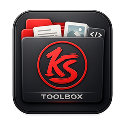

<p align="center">
  
</p>

<h1 align="center">KS ToolBox</h1>

<p align="center"><b>One window, 17 daily batch tools.</b><br>
A fast, portable, cross-platform desktop app that brings a suite of practical
file / image / video / audio / asset batch utilities under a single UI —
free, offline, no credits, no cloud.</p>

---

KS ToolBox is a **plugin toolbox**: one CustomTkinter shell that auto-discovers
self-contained tools. Every tool works the same way — a **dry-run preview**, a
**mirror-the-input-folder** batch, atomic writes, a per-run manifest, and clear
errors instead of crashes. It is **deterministic-first**: 16 of 17 tools use no AI
at all, and the one that can (Alpha Doctor) is deterministic by default with an
*optional* utility model. Nothing heavy loads at startup (~230 ms to open).

## Tools

### 🎬 Video & Audio
| Tool | What it does |
|---|---|
| **Video Compressor** | Shrink videos without visible quality loss — decides if a file is even worth re-encoding, then proves the result with a VMAF quality gate before touching the original. |
| **Video Chopper** | Split a video into clips at black-frame gaps (scene/take boundaries). Lossless stream-copy or frame-accurate re-encode. |
| **Audio Tool** | Batch convert / trim / fade / loudness-normalize audio via the bundled ffmpeg. |

### 🖼️ Images
| Tool | What it does |
|---|---|
| **Image Rescale** | Batch-resize four ways (longest-side, megapixels, scale factor, fit-inside) with snap-to-grid and upscale gating. |
| **Format Converter** | Convert images ↔, audio/video (ffmpeg), and documents (md/docx/html → pdf, pdf → image/text). |
| **Pixel Art Converter** | Turn images into clean pixel art — chunky pixels, reduced palette, sharp alpha. |
| **To SVG** | Vectorize raster images to SVG (vtracer). |
| **Icon Normalizer** | Trim, square-pad, and resize icons/sprites to a uniform canvas. |
| **Showcase** | Present your work: contact sheets, framed hero renders, and before/after comparisons. |

### 🎮 Game / Asset workflow
| Tool | What it does |
|---|---|
| **Alpha Doctor** | Remove backgrounds & repair alpha — deterministic chroma / auto-solid / edge-flood keying + despill/defringe/premultiply, with an *optional* u2net AI method for hard photos. |
| **Material Converter** | Pack/convert/rename PBR texture-map sets — ORM/MOS packing, DirectX↔OpenGL normals, gloss↔roughness, Unity/Unreal/Godot/Blender/glTF presets. |
| **Sprite Viewer** | View & play sprite sheets and animations — grid/cell/auto-detect slicing, playback, slice-grid overlay. |
| **Tileset Checker** | Score & preview how seamlessly a texture tiles — seam score, offset preview, N×N tile montage. |
| **Texture Renderer** | Batch-export textures from Substance Designer (`.sbsar`) and Material Maker (`.ptex`) projects. *(requires those external tools)* |
| **Package Extractor** | Extract Unity `.unitypackage` + zip/tar archives and rebuild the original folders — with zip-slip / symlink / decompression-bomb guards. |

### 🔍 Library & Dataset
| Tool | What it does |
|---|---|
| **Asset Auditor** | Find duplicates (exact + perceptual), corrupt/empty/oversized files, unsafe names, and resolution issues → HTML/JSON/CSV report. |
| **Dataset Manager** | Pair images with captions, split train/val/test, bucket by resolution, batch-edit captions — copy-only, never destroys originals. |

Every batch tool **previews before it writes**, **never touches originals** unless
you explicitly opt in (with a confirmation), and writes a CSV manifest.

## Run it

**Portable build (no Python needed).** Grab/build the one-folder release and
double-click `KS ToolBox.exe` — a Python interpreter and all dependencies are
bundled. Copy the folder anywhere; it's self-contained.

**From source:**
```bash
pip install -r requirements.txt          # core (small)
pip install -r requirements-optional.txt # extras for the tools you use (optional)
python main.py
```
External binaries: **ffmpeg + ffprobe** power the video/audio tools and Format
Converter's A/V (bundle them in `bin/` or install on PATH).

## Build a portable release

```powershell
powershell -File build.ps1
```
Produces `dist/KS ToolBox/` — a portable folder with a bundled Python. See
`THIRD_PARTY_NOTICES.md` for FFmpeg's license obligations when redistributing.

## Design

- **Engine ≠ UI.** Each tool is pure headless logic (`engine.py`) + a thin UI
  (`panel.py`). Errors are values (a standard envelope), never crashes.
- **Deterministic-first.** 16 of 17 tools use no AI; Alpha Doctor is deterministic
  by default with an optional u2net utility model. No CUDA, no cloud, no accounts.
- **Lazy & portable.** A tool's heavy dependency loads only when you open it; a
  missing one is announced in-panel, never a startup failure.

Full analysis in [`docs/KS_TOOLBOX_OPTIMIZATION_AUDIT.md`](docs/KS_TOOLBOX_OPTIMIZATION_AUDIT.md).
Reproducible benchmarks (incl. `run_all_smoke.py`) in [`benchmarks/`](benchmarks/).

## Add a tool

Drop a folder in `tools/` exposing a module-level `TOOL` — discovery finds it, the
shell shows it, no other file changes. See [`CONTRIBUTING.md`](CONTRIBUTING.md).

## License

KS ToolBox's code is **MIT** (see [`LICENSE`](LICENSE)). Bundled/optional
third-party components carry their own licenses — notably a bundled FFmpeg build
with x264/x265 is GPL; see [`THIRD_PARTY_NOTICES.md`](THIRD_PARTY_NOTICES.md).
